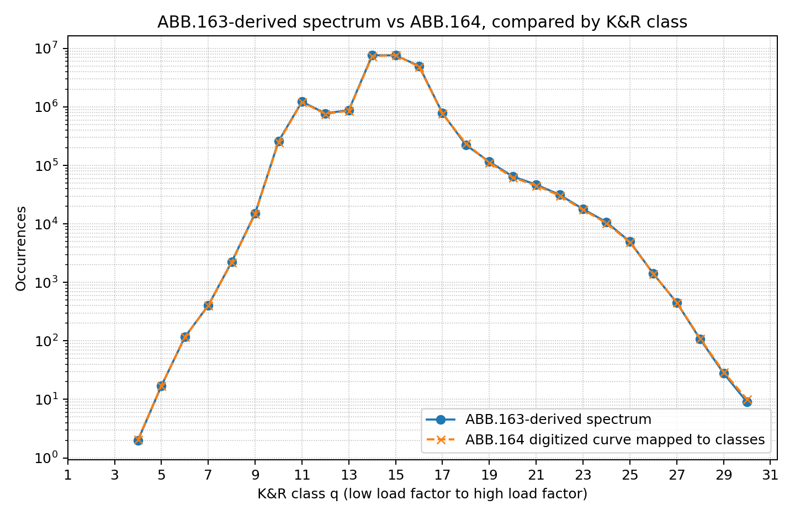

## Structural Life Monitoring for Composite Gliders

### Methodology Report

**Revision Candidate 19 (RC19) — 10-bit K&R class-scale update**

*Based on: "Extension of Glider Life using Structural Life Monitoring" — J.L. Derouineau, FFVP / EGU* [7]

------

### 1. Purpose and Scope

This document describes the methodology used to assess and justify extended operational life for composite gliders using Structural Life Monitoring (SLM). The method calculates an Equivalent Fatigue Index (EFI) from onboard acceleration measurements and compares the measured operational severity with the accepted certification reference severity represented by the Kossira & Reinke Utility spectrum.

The methodology applies to composite gliders operated within the EASA CS-22 Utility-category flight envelope and for which a Service Life Limit has been established. Aerobatic-category operation and operation outside Utility-category limitations are outside the initial SLM scope.

The numerical Utility reference spectrum used by the EFI calculation is generated from the published ABB.163 Utility Markov matrix using the Kossira & Reinke Markov-matrix-to-occurrence-spectrum transformation. ABB.164 is used as the published graphical check showing that the ABB.163-derived spectrum reproduces the original Kossira & Reinke Utility curve [2] [8].

The purpose of SLM is to compare measured usage with the accepted reference exposure using the same conservative fatigue-severity calculation. Continued operation beyond the certified Service Life Limit may be justified when cumulative EFI remains below the certification EFI limit and the required continued-airworthiness provisions are satisfied.

------

### 2. Regulatory Basis

The method is consistent with the following regulatory framework:

- **CS 22.627** (Fatigue Strength): requires structures to be designed to avoid stress concentrations in normal service; does not explicitly mandate a specific life limit.
- **EASA CM-S-006**: endorses the use of Kossira & Reinke load spectra for fatigue analysis and testing of sailplanes.
- **CS-STAN / Part ML**: governs installation of onboard recorders and maintenance requirements.

EASA has already accepted multiple means of compliance for CS 22.627, including full-scale fatigue testing and static overload testing. SLM is proposed as an additional means of compliance for ageing glider life management. Similar measured-usage principles have been used in aviation usage monitoring and Individual Aircraft Tracking, particularly in military aviation. SLM does not attempt to reproduce those military approaches directly or claim that they are directly transferable to gliders; the relevant precedent is the general principle that measured usage can be compared with a conservative reference usage assumption, provided the method is controlled, conservative, and supported by inspections.

------

### 3. Key Principles

**Service Life Limit and Certification EFI Limit**

The certified Service Life Limit (typically 12,000 flight hours) corresponds to an accepted fatigue exposure established during type certification. Certification is demonstrated against the safety-factored life: with a Safety Factor of 3, structural integrity is shown for 36,000 hours of equivalent fatigue exposure. In classical Palmgren-Miner notation, the cumulative value is often denoted $D$, for damage, and $D=1$ is associated with the theoretical failure threshold. In this SLM methodology, the same mathematical quantity is denoted Equivalent Fatigue Index, or $EFI$, because it is used as a conservative usage-severity index rather than as a direct measurement of physical composite damage.

The reference condition for the SLM calculation is therefore:

$$
EFI_{ref,36000}=1
$$

for the safety-factored 36,000-hour reference exposure, and:

$$
EFI_{ref,12000}=\frac{1}{3}
$$

for the certified 12,000-hour service life. The certification EFI limit used by the SLM method is:

$$
\boxed{EFI_{limit} = \frac{1}{3}}
$$

This does not mean that the actual composite structure is assumed to fail at 36,000 hours, nor that its physical damage state is known at 12,000 hours. For SLM, the accepted certification reference exposure is deliberately treated as the full allowable fatigue-exposure budget. This is conservative because the method does not take credit for any unobserved residual margin beyond the certified exposure.

**SLM as a reference-spectrum comparison method**

SLM is not certification by analysis and does not replace the structural substantiation performed during Type Certification. It does not attempt to determine the absolute fatigue life of a composite structure, identify the critical structural location, or predict the critical composite failure mode.

The method has a more limited objective: it uses the already accepted certified life exposure as a conservative reference and compares it with the measured operational exposure of an individual glider. The Palmgren-Miner calculation is therefore used as an Equivalent Fatigue Index, calculated consistently for the reference spectrum and for the measured spectrum.

**Proportionality between load factor and structural stress**

Within the Utility-category certified flight envelope — defined by speed, configuration (flaps, airbrakes), and authorized mass loading — load-factor variations are used as the practical measured proxy for the stress variations used in the EFI comparison. This proxy is justified by the proportionality, during aerodynamic flight, between vertical load factor and the bending-related structural stress variations that drive the reference Kossira & Reinke fatigue spectra. The manufacturer's design ensures that no critical stress exceeds the allowable value for any authorized combination of these parameters.

This proportionality is applicable during aerodynamic flight phases. It does not hold during non-aerodynamic phases such as takeoff roll, landing roll, or winch launch. These phases shall therefore be excluded from the measured aerodynamic spectrum. The Kossira & Reinke spectra-generation and EFI-rate calculation uses only valid aerodynamic recording time. Any separate operational accounting for non-instrumented, invalid, or excluded time is controlled by the approved ICA, IOMM, or operational procedure.

The Palmgren-Miner calculation is applied to stress amplitudes associated with load cycles, not to absolute static stress values alone. For a given critical location, if the stress amplitude is proportional to the load-factor amplitude within the authorized Utility-category flight envelope, the unknown proportionality coefficient is absorbed into the calibration of the EFI model and cancels when the reference and real spectra are compared using the same method. The absolute value of this coefficient is therefore not required for the proposed EFI-ratio approach. This does not mean that all structural locations have the same stress for a given load factor or share the same proportionality coefficient; it means that, within the authorized Utility envelope and for aerodynamic flight phases, load-factor variations provide a consistent proportional basis for the reference-versus-measured fatigue-severity comparison.

**High Cycle Fatigue regime**

Glider structures are designed so that operational stress levels remain well within the elastic domain of materials. The structure is therefore considered to operate in the High Cycle Fatigue (HCF) regime, which justifies the use of a Basquin-type S/N curve representation for the conservative EFI calculation used in this methodology.

------

### 4. Methodology

#### 4.1 Reference Load Spectrum

The reference load spectrum for this methodology is the Kossira & Reinke Utility spectrum [2][8], recognized by EASA CM-S-006 as a basis for sailplane fatigue analysis.

For the approved SLM calculation package, the Utility reference occurrence table shall be generated from the published ABB.163 Utility Markov matrix using the controlled transformation defined in Appendix A.8. This ABB.163-derived occurrence table is the operational reference input for EFI.

The ABB.163-derived table is verified against ABB.164, which provides the original published graphical occurrence curve. ABB.164 is not used as a digitized numerical reference table.

The reference occurrence table is normalized to the reference duration defined in the approved calculation package. In the generic SLM equations, the working reference normalization is 6,000 flight hours. For certification-limit calibration, the reference occurrences are scaled to the certified 12,000-hour life.

The original Kossira & Reinke spectrum is used rather than the more recent KoSMOS variant, because the SLM method compares real measured spectra cycle-for-cycle against the original certification reference basis.

#### 4.1.1 Use of the reference spectrum in the methodology

The ABB.163-derived Utility reference spectrum is used:

1. to calibrate the EFI model at the certified 12,000-hour life (§4.4);
2. to compute the reference EFI over the same valid flight duration as the measured data (§4.5);
3. to provide the reference EFI rate used by the approved continued-airworthiness process when required.

#### 4.2 Real Load Spectrum Acquisition

The vertical load factor $N_z$ is recorded continuously during flight using a tri-axial accelerometer located as close as possible to the Center of Gravity, in a rigid area near the wing spar. Proximity to the CG minimizes contamination from centripetal accelerations during attitude changes, while a rigid mounting area avoids local structural flexibility corrupting the measurement. Atmospheric turbulence and trajectory induce load variations at relatively low frequency, typically below 10 Hz  (CS 22.341).

Accelerometer requirements:

- Minimum sampling rate: 20 Hz
- 6-face calibration at each annual inspection to ensure recorder performance
- Installation calibration with the glider in level-flight attitude and wings level, so that the recorder-corrected vertical axis is aligned with the gravity vector in the reference flight attitude

Data is stored on onboard electronic memory and uploaded to a central repository.

**Non-flight phases.** During takeoff roll, landing roll, winch launch, and any other phase dominated by non-aerodynamic forces, the proportionality between vertical load factor and structural stress no longer holds. The accelerometer signal from these sequences shall therefore not be used to build the real aerodynamic load spectrum. The Kossira & Reinke spectra-generation and EFI-rate calculation uses only valid aerodynamic recording time.

#### 4.3 Load Spectrum Processing — Kossira & Reinke Counting Method

Real measured spectra are generated using the Kossira & Reinke counting method [2][8]. The same class table, filtering rule, Markov-matrix convention, average-load-factor convention, and exceedance transformation are used for measured data and for the ABB.163-derived reference spectrum.

The processing chain for real measured data shall be:

1. validate and select the aerodynamic flight samples to be credited by SLM;
2. convert each valid load-factor sample into a 1024-class representation;
3. apply the Kossira & Reinke hysteresis filter in 1024-class space;
4. convert the retained filtered values into 32-class load-factor values;
5. remove repeated consecutive 32-class values;
6. extract the alternating peak/valley sequence;
7. build the 32×32 raw Markov transition matrix;
8. determine the average load factor for the processed sequence;
9. transform the raw Markov matrix into upper and lower exceedance occurrences;
10. produce the 32-class occurrence spectrum;
11. compute EFI using §4.4 and Appendix B.

Appendix A defines the Kossira & Reinke software rules, Appendix B defines the EFI calculation rules, and Appendix C documents the ABB.163-derived reference spectrum and its validation against ABB.164.

#### 4.4 Equivalent Fatigue Index — Palmgren-Miner Rule

The Palmgren-Miner rule provides a linear cumulative index for fatigue. In classical notation this value is often denoted $D$, for damage. In the present SLM method, the same mathematical quantity is referred to as the **Equivalent Fatigue Index**, noted $EFI$, to avoid implying that the calculation represents measured physical damage in the composite structure:

$$
EFI = \sum_i \frac{n_i}{N_i}
$$

where $n_i$ is the number of cycles at load factor level $i$, and $N_i$ is the number of cycles to failure at that level.

For SLM, the Palmgren-Miner rule is used primarily as a consistent comparison framework between two spectra: the reference spectrum and the measured real-flight spectrum. The absolute value of EFI should not be interpreted as a direct measurement of physical composite damage at a specific structural location.

$N_i$ values are derived from the reference spectrum and conservative fatigue parameters using the Basquin model. To simplify the notation, the positive EFI exponent is defined as:

$$
\boxed{k = -\frac{1}{b}}
$$

For the generic SLM methodology, the selected composite fatigue parameter is:

$$
\boxed{b=-0.16}
$$

and therefore:

$$
\boxed{k=6.25}
$$

The selected value is a conservative engineering parameter for ageing composite glider primary structures made predominantly from conventional GFRP/CFRP epoxy laminates. It is not intended to be a universal composite-material constant or a type-specific material property.

The value is selected from the supporting review of published fatigue-fit parameters for epoxy-based GFRP/CFRP composite structures. Wind-turbine blade composite data are used as the closest available published analogue because they involve large, lightly loaded GFRP/CFRP structures operating in high-cycle fatigue under variable-amplitude loading. In the SNL/MSU/DOE fatigue database review, the steepest identified epoxy GFRP stress-fit exponent among the retained primary comparison data is $B=b=-0.1556$ for a QQ1 glass/epoxy multidirectional laminate at $R=0.1$ [9]. Additional SNL/MSU/DOE epoxy GFRP data and AIAA/SNL-MSU-DOE database trends give less severe values, while carbon-dominated epoxy laminates show much shallower stress-life slopes [9][10]. General composite fatigue references also emphasize that fatigue parameters depend on material system, layup, stress ratio, manufacturing process, environment, defects, repairs, and failure mode [11][12][13].

The generic value $b=-0.16$ is therefore chosen because it is slightly steeper than the steepest retained GFRP epoxy value and remains strongly conservative for CFRP-dominated epoxy structures. The selected value shall be treated as a conservative EFI severity-weighting parameter for the generic SLM methodology. For a type-specific certification program, it should be confirmed by the certification authority and, where required, by representative material, detail, repair, environmental, or structural evidence.

The $N_i$ expression, calibrated against the certification EFI limit, is:

$$
\boxed{%
N_i \;=\; C'\,\bigl|\mathrm{LF}_i-LF_{average,ref}\bigr|^{-k}
}
$$

where the calibrated constant $C'$ is:

$$
\boxed{%
C' \;=\; 3 \;\sum_j n_{j,ref,12000}\,\bigl|\mathrm{LF}_j - LF_{average,ref}\bigr|^k
}
$$

where the symbols are defined as follows:

- $i$ — index of the load factor level at which $N_i$ is being evaluated.
- $j$ — summation index running over all load factor levels of the reference spectrum. It is used inside the constant $C'$ to distinguish the summation over the whole spectrum from the single level $i$ at which $N_i$ is evaluated. The two indices range over the same set of load factor classes; different letters are used only to avoid confusion between the bound summation variable and the free index $i$.
- $n_{j,ref,12000}$ — number of cycles (occurrences) at load factor level $j$ in the reference Kossira & Reinke Utility spectrum, normalized to the certified life of 12,000 flight hours and processed with the counting method of §4.3.
- $\mathrm{LF}_j$ — load factor value of class $j$; $\mathrm{LF}_i$ — load factor value of class $i$.
- $LF_{average,ref}$ — average load factor defined by the approved reference data package in accordance with Appendix A.7.
- $LF_{average,real}$ — average load factor generated by the Kossira & Reinke processing of the real measured data in accordance with Appendix A.7.
- $b$ — Basquin S/N slope exponent; $b = -0.16$ for the selected generic composite case.
- $k=-1/b$ — positive EFI exponent used in the EFI summations; $k=6.25$ for the selected generic composite case.
- $C'$ — proportionality constant linking load factor amplitude to the number of cycles to failure. It is not a free parameter: it is fixed by calibrating the reference-spectrum EFI against the certification EFI limit $EFI_{ref,12000} = 1/3$.

Because the same calibrated constant $C'$, EFI exponent $k$, load-factor class definition, and Kossira & Reinke counting method are applied to both the reference and the real spectra, the absolute value of the load-factor-to-stress proportionality coefficient cancels in the EFI ratio and need not be known. The amplitude term is evaluated relative to the average load factor of the spectrum being assessed: $LF_{average,ref}$ for the reference spectrum and $LF_{average,real}$ for the real measured spectrum.

Real-flight EFI accumulation is then:

$$
\boxed{
EFI_{real}\;=\;\frac{1}{C'}\sum_i n_{i,real}\,\bigl|\mathrm{LF}_{i}-{LF_{average,real}}\bigr|^k
}
$$

The core calculation defined in this methodology computes $EFI_{real}$ for the valid aerodynamic recording duration included in the processed data set. It does not require missing, invalid, excluded, or non-instrumented duration as an input to the Kossira & Reinke spectrum-generation or EFI-rate calculation.

#### 4.5 Life Extension Assessment

The EFI ratio $R$ quantifies the life extension potential:

$$
\boxed{R = \frac{EFI_{ref}}{EFI_{real}}}
$$

where both values are computed over the same observed flight duration $t_{real}$. Here $EFI_{ref}$ is the reference-spectrum EFI normalized to $t_{real}$ — not the full-life value $EFI_{ref,12000} = 1/3$ of §3 and §4.4 — and $EFI_{real}$ is the measured EFI of §4.4 over the same $t_{real}$.

To evaluate $R$ in practice, the reference and real spectra must cover the same exposure time. The published reference spectrum (normalized to 6,000 flight hours) is scaled down to $t_{real}$, and the floor function $\lfloor \cdot \rfloor$ is applied to the scaled reference occurrences to add conservatism (the real observation period $t_{real}$ being much shorter than 6,000 hours). The operational expression, using the EFI exponent $k$, is:

$$
\boxed{R = \frac{\sum_i \left\lfloor \dfrac{n_{i,ref}\,t_{real}}{6000} \right\rfloor \,\bigl|\mathrm{LF}_i - LF_{average,ref}\bigr|^k}{\sum_i n_{i,real}\,\bigl|\mathrm{LF}_i - LF_{average,real}\bigr|^k}}
$$

where $n_{i,ref}$ and $n_{i,real}$ are the occurrences at load factor level $LF_i$ in the reference and real spectra respectively. This is the same computation as §4.4: substituting the $EFI_{ref}$ and $EFI_{real}$ expressions into $R = EFI_{ref}/EFI_{real}$, the constant $C'$ is identical for both spectra and cancels, leaving only the spectra and the EFI exponent $k$.

The estimated life extension beyond the certified limit is:

$$
\boxed{t_{extension} = (R - 1) \times t_{remaining\;ref}}
$$

where $t_{remaining\;ref}$ is the flight time remaining until the certified 12,000-hour limit is reached under reference spectrum assumptions.

As an illustration, preliminary analysis of approximately 35 hours of flight data on an instrumented Janus B yielded an EFI ratio of about 26 for the selected composite parameter $k=6.25$, corresponding to a potential life extension of several thousand hours for typical training and cross-country operations. In the supporting white paper [7], this illustrative case corresponds to approximately 7,500 hours of extension for an aircraft with about 300 hours remaining to the certified 12,000-hour limit. The same data evaluated with a metallic-part parameter $k=5$ yields an EFI ratio of about 12, which may be useful when assessing the adequacy of continuing inspection intervals for metallic fittings and attachments. These figures are illustrative of the method rather than certified results.

Life extension is conditional on the assumption that future operations follow the same load pattern as those already observed. $R$ and $t_{extension}$ are therefore recalculated at each Airworthiness Review Certificate (ARC) renewal based on accumulated data. $R$ is highly sensitive to occasional high-load maneuvers: as an order of magnitude, a single 4g maneuver every two flight hours can reduce $R$ by more than an order of magnitude relative to gentle cross-country flying.

------

### 5. Applicability and Limitations

- The method applies to composite gliders operated within their certified Utility-category flight envelope.
- Aerobatic-category operation and operation outside Utility-category limitations are not credited under the initial SLM scope.
- SLM compares measured operational severity with the accepted certification reference exposure using a common EFI calculation.
- The Basquin parameter $b=-0.16$ is used as a conservative severity-weighting parameter applied consistently to the reference and measured spectra.
- Continued operation remains subject to the approved ICA requirements, including recorder calibration, data processing, structural inspections, repairs, bonds, metallic fittings, and other continued-airworthiness items defined by the approved process.

------

### 6. Concept of Operation associated with methodology

This section provides the methodology-level Concept of Operation (CONOPS). Practical installation, calibration, data acquisition, data validation, processing, maintenance, inspection, reporting, and airworthiness decision rules are controlled by the STC certification package, including the Certification Programme, ICA, and IOMM.

**Phase 1 — Instrumentation and Data Collection** *(below the certified life limit)*
The SLM recorder is installed in accordance with the approved installation basis. Installation calibration and annual 6-face calibration are recorded in the aircraft logbook. Flight data are uploaded to the controlled SLM repository and processed using the approved toolset.

**Phase 2 — EFI Evaluation at the Certified Life Limit**
When the aircraft reaches the certified life limit, a structural inspection is performed in accordance with the approved ICA. Continued operation may be authorized when the inspection result is acceptable and the approved EFI assessment shows:

$$
EFI_{total}<\frac{1}{3}
$$

**Phase 3 — Operation Beyond the Certified Life Limit**
Operation beyond the certified life limit continues with SLM monitoring and the approved continued-airworthiness controls. A Go/No-Go decision is made at each annual visit, ARC renewal, or other approved review point using the validated SLM EFI status report. The Go criterion includes both the current cumulative EFI and the projected EFI rate, so that the $EFI=1/3$ limit is not reached before the next scheduled inspection or review. Recurring structural inspections continue at the interval defined in the approved ICA.

------

### 7. Approval and Deployment Pathway

This section gives only the methodology-level approval context. The detailed certification artifacts, document list, compliance responsibilities, EASA involvement, and approval schedule are controlled by the STC Certification Programme and associated Master Document List.

SLM deployment should be supported by an approved certification pathway, such as an EASA Supplemental Type Certificate (STC) or another approval route accepted by the competent authority. The Certification Programme defines the compliance approach for the STC, including the applicable aircraft, the approved operating domain, the proposed means of compliance, the required certification artifacts, and the EASA involvement for review or approval.

The certification package should include, as applicable:

- Certification Programme;
- Certification Review Item (CRI) or equivalent agreement on the proposed means of compliance;
- SLM Methodology Report (this document);
- Instructions for Continued Airworthiness (ICA);
- Installation, Operating and Maintenance Manual (IOMM) for the SLM recorder and associated data process;
- validation reports, Master Document List, Compliance Check List, and Master Compliance Report, as defined in the Certification Programme.

The Certification Programme shall remain the controlling document for the detailed approval artifacts. This methodology report defines the EFI calculation principles, assumptions, and limitations; the ICA and IOMM define the operational procedures, inspections, calibration, data handling, abnormal-case treatment, and release-to-service conditions.

------


### 8. Appendix A — Kossira & Reinke Processing Rules for Software Implementation

This appendix defines the deterministic software rules used to generate a 32-class occurrence spectrum from valid aerodynamic load-factor data using the Kossira & Reinke method.

#### A.1 Constants, class convention, and notation

The Kossira & Reinke processing chain uses 1024 fine classes and 32 coarse classes:

$$
N_{fine}=1024
$$

$$
N_{coarse}=32
$$

For the Utility reference reconstruction, the load-factor range is taken from the ABB.164 axis:

$$
LF_{min}=-4g
$$

$$
LF_{max}=+7g
$$

The resulting range is:

$$
LF_{range}=11g
$$

This is consistent with a 10-bit acquisition or digitization hypothesis: the 11 g range is divided into 1024 fine classes. Therefore:

$$
\Delta LF_{fine}=\frac{11}{1024}=0.0107421875g
$$

Grouping 32 fine classes into one coarse Kossira & Reinke class gives:

$$
\Delta LF_{coarse}=32\Delta LF_{fine}=\frac{11}{32}=0.34375g
$$

The Kossira & Reinke hysteresis threshold is:

$$
DX=10
$$

therefore:

$$
DX_g=10\Delta LF_{fine}=0.107421875g
$$

The approved Utility class table shall be included in the calculation package. In zero-based notation, coarse class $c$ covers the interval:

$$
LF_{min}+c\Delta LF_{coarse}\le LF < LF_{min}+(c+1)\Delta LF_{coarse}
$$

with:

$$
c=0\ldots31
$$

For EFI calculation, the class representative value is the class center:

$$
LF(c)=LF_{min}+\left(c+\frac{1}{2}\right)\Delta LF_{coarse}
$$

Equivalently, in one-based notation:

$$
LF(q)=LF_{min}+\left(q-\frac{1}{2}\right)\Delta LF_{coarse}
$$

with:

$$
q=1\ldots32
$$

where $q=1$ is the lowest load-factor class and $q=32$ is the highest load-factor class.

Software shall use zero-based class numbering internally unless otherwise specified:

- fine classes: $0 \ldots 1023$;
- coarse classes: $0 \ldots 31$.

#### A.2 Load factor to 1024-class conversion

For each valid load-factor sample $LF$, the corresponding 1024-class value shall be:

$$
q_{1024}=\mathrm{clip}\left(
\left\lfloor
\frac{LF-LF_{min}}{\Delta LF_{fine}}
\right\rfloor,
0,
1023
\right)
$$

where $LF_{min}=-4g$ and $\mathrm{clip}(x,0,1023)$ limits the value to the valid range.

The load-factor value associated with a fine class may be represented by the class center:

$$
LF(q_{1024}) = LF_{min} + \left(q_{1024}+\frac{1}{2}\right)\Delta LF_{fine}
$$

Samples clipped to the first or last fine class shall be retained according to the normal processing rules. Clipping events shall be counted and reported when detailed data-quality reporting is required.

#### A.3 Hysteresis filtering in 1024-class space

The Kossira & Reinke filter shall be applied before reduction to 32 classes.

The first valid sample shall be retained as the first filtered value.

For each subsequent sample $q_{1024}(n)$, the sample shall be retained only if:

$$
\left|q_{1024}(n)-q_{1024,last\_retained}\right| > DX
$$

where $q_{1024,last\_retained}$ is the last retained filtered value.

Samples for which:

$$
\left|q_{1024}(n)-q_{1024,last\_retained}\right| \le DX
$$

shall be rejected as low-amplitude variation/noise for Kossira & Reinke counting.

The retained filtered sequence shall be stored as an auditable intermediate output when detailed processing evidence is required.

#### A.4 Reduction from 1024 classes to 32 classes

Each retained 1024-class value shall be converted to a 32-class value using integer division:

$$
q_{32} = \left\lfloor \frac{q_{1024}}{32} \right\rfloor
$$

The load-factor value associated with a coarse class is the class center:

$$
LF(q_{32}) = LF_{min} + \left(q_{32}+\frac{1}{2}\right)\Delta LF_{coarse}
$$

Repeated consecutive 32-class values shall be removed before peak/valley extraction, because they do not define a transition between different load-factor classes.

#### A.5 Peak and valley extraction

The input to peak/valley extraction shall be the filtered 32-class sequence after removal of repeated consecutive values.

For three consecutive retained 32-class values $a$, $b$, and $c$:

- $b$ is a peak if $b>a$ and $b>c$;
- $b$ is a valley if $b<a$ and $b<c$.

The first and last values of the filtered 32-class sequence shall be retained when required to define the first or last transition of the processed segment.

The approved implementation shall define endpoint and plateau handling deterministically. The final peak/valley sequence shall not contain duplicate consecutive values. If the processed segment contains fewer than two peak/valley values, no Markov transition shall be generated.

The peak/valley sequence shall be stored as an auditable intermediate output when detailed processing evidence is required.

#### A.6 Raw Markov transition matrix

The raw Markov transition matrix shall be a 32×32 integer matrix $M$.

The matrix convention shall be:

$$
M(i,j) = \text{number of transitions from class } j \text{ to class } i
$$

where:

- column $j$ is the “from” class;
- row $i$ is the “to” class.

For each consecutive pair in the peak/valley sequence:

$$
p_n \rightarrow p_{n+1}
$$

the matrix cell shall be incremented as follows:

$$
M(p_{n+1},p_n) = M(p_{n+1},p_n)+1
$$

Diagonal transitions $M(k,k)$ shall be zero because repeated consecutive 32-class values are removed before peak/valley extraction and because a transition from a class to itself is not a peak/valley transition.

The total number of Markov transitions shall satisfy:

$$
\sum_i\sum_j M(i,j) = N_{PV}-1
$$

where $N_{PV}$ is the number of values in the peak/valley sequence.

For a closed sequence, each class shall have equal arrivals and departures:

$$
\sum_j M(k,j) = \sum_i M(i,k)
$$

For an open sequence, the first class may have one additional departure and the last class may have one additional arrival. This imbalance shall be reported but shall not by itself invalidate the sequence.

#### A.7 Average load factor convention

A single average-load-factor value shall be associated with each spectrum data set and used for both:

1. splitting the raw Markov matrix into upper and lower exceedance branches; and
2. computing the load-factor amplitude term in the EFI calculation.

For real measured data, the default average shall be the arithmetic mean of the valid aerodynamic load-factor samples used for the processed flight or data set:

$$
LF_{average,real} = \frac{1}{N}\sum_{n=1}^{N} LF(n)
$$

The corresponding average 32-class index is the class containing the average load factor:

$$
k_{avg,real}=\mathrm{clip}\left(
\left\lfloor
\frac{LF_{average,real}-LF_{min}}{\Delta LF_{coarse}}
\right\rfloor,
0,
31
\right)
$$

The approved reference-data package shall provide $LF_{average,ref}$ for the ABB.163-derived Utility reference spectrum. For the Utility reference data used in Appendix C:

$$
LF_{average,ref}=1.0g
$$

which lies in one-based class $q=15$ with the class convention of Appendix A.1.

#### A.8 Markov matrix transformation into exceedance occurrences

A raw 32×32 Markov matrix shall be transformed into a 32-class occurrence spectrum by counting upward and downward exceedances relative to the applicable average class $k_{avg}$.

The matrix convention is:

$$
M(i,j)=\text{number of transitions from class }j\text{ to class }i
$$

For classes at or above the average class, $k \ge k_{avg}$:

$$
O(k)=\sum_{i=k}^{31}\sum_{j=0}^{k-1}M(i,j)
$$

For classes below the average class, $k < k_{avg}$:

$$
O(k)=\sum_{i=0}^{k}\sum_{j=k+1}^{31}M(i,j)
$$

With this convention, the average class belongs to the upper branch. No smoothing, zeroing, or replacement of the average-class occurrence shall be performed.

The occurrence spectrum $O(k)$ shall be stored as an auditable intermediate output when generated by the SLM software.

#### A.9 Required Kossira & Reinke processing outputs

The software shall be capable of producing, for each real measured processed flight or data set:

1. valid sample count and processed duration;
2. 1024-class filtered sequence;
3. 32-class filtered sequence;
4. peak/valley sequence;
5. raw 32×32 Markov transition matrix;
6. average load factor $LF_{average,real}$;
7. average 32-class index $k_{avg,real}$;
8. upper and lower exceedance occurrence branches;
9. final 32-class occurrence table;
10. processing warnings and validity flags.

#### A.10 Kossira & Reinke processing verification checks

The software shall verify and report the following processing-consistency checks for real measured data processed from raw samples:

1. the sum of the raw Markov matrix equals the number of peak/valley transitions;
2. diagonal Markov cells are zero;
3. raw Markov row/column imbalance is consistent with the sequence start/end conditions.

#### A.11 Reference occurrence table and reference class table

The approved calculation package shall include:

1. the ABB.163-derived Utility reference occurrence table;
2. the associated Kossira & Reinke load-factor class table;
3. the ABB.163 matrix source and import mapping;
4. the transformation algorithm version;
5. the reference normalization duration;
6. the reference average load factor.


### 9. Appendix B — EFI Calculation Rules for Software Implementation

This appendix defines the deterministic software rules used to compute EFI and associated life-extension quantities from the occurrence spectra generated by Appendix A.

#### B.1 Required inputs

The EFI software shall use the following inputs:

1. approved ABB.163-derived Utility reference occurrence table;
2. approved Kossira & Reinke load-factor class table;
3. reference normalization duration;
4. real measured occurrence table generated by Appendix A;
5. valid real aerodynamic recording duration associated with the real measured occurrence table;
6. $LF_{average,ref}$ and $LF_{average,real}$;
7. Basquin exponent $b$ and positive EFI exponent $k=-1/b$.

For the generic SLM methodology:

$$
b=-0.16
$$

$$
k=6.25
$$

The 6,000-hour reference normalization, the 12,000-hour certified-life calibration basis, and the safety factor of 3 are fixed methodology rules.

#### B.2 Average load factor used by EFI

The EFI calculation shall use:

- $LF_{average,ref}$ for the ABB.163-derived Utility reference spectrum;
- $LF_{average,real}$ for the real measured spectrum.

The same average-load-factor convention shall be used for Markov-matrix splitting and EFI amplitude calculation for a given spectrum data set.

#### B.3 Reference spectrum scaling

For the generic SLM methodology, the reference occurrence table is normalized to 6,000 flight hours.

For certification-limit calibration at 12,000 flight hours:

$$
n_{i,ref,12000}=2n_{i,ref,6000}
$$

For safety-factored reference exposure at 36,000 flight hours:

$$
n_{i,ref,36000}=6n_{i,ref,6000}
$$

For comparison with a real observation time $t_{real}$, the reference occurrence table shall be scaled to the same duration. When the conservative integer-floor convention is used:

$$
n_{i,ref,t}=\left\lfloor n_{i,ref,6000}\frac{t_{real}}{6000} \right\rfloor
$$

#### B.4 Calibration of the EFI constant

The calibrated constant $C'$ shall be computed from the 12,000-hour reference spectrum so that:

$$
EFI_{ref,12000}=\frac{1}{3}
$$

The constant shall be:

$$
C' = 3 \sum_j n_{j,ref,12000}
\left|LF_j-LF_{average,ref}\right|^k
$$

where $LF_j$ is the approved Kossira & Reinke load-factor value for class $j$.

#### B.5 Number of cycles to failure

For each load-factor class $i$, the equivalent number of cycles to failure shall be:

$$
N_i = C'\left|LF_i-LF_{average,ref}\right|^{-k}
$$

If $LF_i = LF_{average,ref}$ exactly, the corresponding amplitude is zero. The EFI contribution of that class is zero, and $N_i$ may be reported as infinite or not applicable to avoid division by zero in software output.

#### B.6 Real-flight EFI

The real-flight EFI shall be computed only from valid real aerodynamic recordings included in the processed data set:

$$
EFI_{real} =
\frac{1}{C'}
\sum_i n_{i,real}
\left|LF_i-LF_{average,real}\right|^k
$$

where $n_{i,real}$ is the occurrence table generated from valid aerodynamic measured data using Appendix A.

#### B.7 EFI ratio

For life-extension assessment over an observed valid aerodynamic recording duration $t_{real}$, the EFI ratio shall compare the measured EFI over that valid recording duration with the reference EFI normalized to the same duration:

$$
R = \frac{EFI_{ref,t}}{EFI_{real,t}}
$$

Using the same constant $C'$, this may be computed as:

$$
R =
\frac{
\sum_i
\left\lfloor
\dfrac{n_{i,ref,6000}t_{real}}{6000}
\right\rfloor
\left|LF_i-LF_{average,ref}\right|^k
}{
\sum_i
n_{i,real}
\left|LF_i-LF_{average,real}\right|^k
}
$$

when the conservative integer-floor convention is used.

#### B.8 Life-extension estimate

The estimated additional life beyond the certified service life shall be:

$$
t_{extension}=(R-1)t_{remaining\;ref}
$$

where $t_{remaining\;ref}$ is the time remaining until the certified service-life limit under reference-spectrum assumptions.

#### B.9 Valid duration reporting

The Kossira & Reinke and EFI software shall report the valid aerodynamic recording duration actually used in the calculation.

#### B.10 Required EFI outputs

The software shall report:

1. reference spectrum source and version;
2. reference occurrence table source, ABB.163 matrix version, transformation algorithm version, normalization duration, load-factor class definitions, and reference average load factor;
3. valid real aerodynamic recording duration;
4. real average load factor;
5. $b$, $k$, and $C'$;
6. reference EFI normalized to the valid real recording duration;
7. real measured EFI;
8. EFI ratio $R$;
9. estimated life extension when requested;
10. processing warnings and data-quality flags.


### 10. Appendix C — ABB.163-Derived Utility Reference Spectrum

This appendix documents the reference-data chain used by the SLM calculation:

```text
ABB.163 Utility Markov matrix
→ Appendix A.8 Markov-matrix-to-spectrum transformation
→ ABB.163-derived Utility occurrence spectrum
→ EFI reference input
```

ABB.164 is used as the published graphical validation of the generated spectrum.

#### C.1 Source material and import convention

The reference spectrum is generated from the published ABB.163 32×32 Utility Markov transition matrix [8]. For the digitized ABB.163 Utility matrix, the printed table label $L$ is mapped to the internal low-to-high class index $q$ by:

$$
q=33-L
$$

This mapping is specific to the ABB.163 reference-data import. Real measured data use the internal class convention of Appendix A.

#### C.2 Load-factor class scale

ABB.164 provides the load-factor scale associated with the published occurrence spectrum. The graph axis spans approximately:

$$
-4g \;\text{to}\; +7g
$$

therefore:

$$
LF_{range}=11g
$$

Kossira & Reinke use 1024 fine classes, which is consistent with a 10-bit acquisition or digitization scale. Dividing the 11 g range into 1024 fine classes gives:

$$
\Delta LF_{fine}=\frac{11}{1024}=0.0107421875g
$$

Each 32-class spectrum bin contains 32 fine classes, therefore:

$$
\Delta LF_{coarse}=32\Delta LF_{fine}=\frac{11}{32}=0.34375g
$$

The Kossira & Reinke hysteresis threshold is therefore:

$$
DX_g=10\Delta LF_{fine}=0.107421875g
$$

The class representative value used for EFI is the class center:

$$
LF(q)=-4.0+\left(q-\frac{1}{2}\right)0.34375
$$

with:

$$
q=1\ldots32
$$

The reference average load factor used for the ABB.163 transformation and EFI is:

$$
LF_{average,ref}=1.0g
$$

This lies in one-based class $q=15$; therefore classes $q=1\ldots14$ form the lower branch and classes $q=15\ldots32$ form the upper branch for the Utility reference transformation.

#### C.3 Generated ABB.163 Utility reference spectrum

The following table is the ABB.163-derived Utility occurrence spectrum generated with the Appendix A.8 transformation. In controlled machine-readable form, it is the operational numerical reference spectrum for EFI. The full reference table, including ABB.163 printed labels and class edges, is part of the calculation package.

| q | LF center (g) | Occ. | q | LF center (g) | Occ. |
|---:|---:|---:|---:|---:|---:|
| 1 | -3.828 | 0 | 17 | 1.672 | 781,639 |
| 2 | -3.484 | 0 | 18 | 2.016 | 222,911 |
| 3 | -3.141 | 0 | 19 | 2.359 | 115,715 |
| 4 | -2.797 | 2 | 20 | 2.703 | 64,698 |
| 5 | -2.453 | 17 | 21 | 3.047 | 46,996 |
| 6 | -2.109 | 116 | 22 | 3.391 | 31,526 |
| 7 | -1.766 | 404 | 23 | 3.734 | 17,932 |
| 8 | -1.422 | 2,241 | 24 | 4.078 | 10,741 |
| 9 | -1.078 | 15,111 | 25 | 4.422 | 4,965 |
| 10 | -0.734 | 258,197 | 26 | 4.766 | 1,411 |
| 11 | -0.391 | 1,229,659 | 27 | 5.109 | 451 |
| 12 | -0.047 | 776,762 | 28 | 5.453 | 107 |
| 13 | 0.297 | 880,781 | 29 | 5.797 | 28 |
| 14 | 0.641 | 7,638,649 | 30 | 6.141 | 9 |
| 15 | 0.984 | 7,615,484 | 31 | 6.484 | 0 |
| 16 | 1.328 | 5,018,617 | 32 | 6.828 | 0 |

#### C.4 Validation against ABB.164 by K&R class

The generated ABB.163 spectrum was compared with the ABB.164 Utility occurrence curve digitized from the published graph. The comparison is performed by K&R class index, not by using the imperfect digitized load-factor coordinates from the scanned figure.



The comparison statistics are:

```text
Compared points:                      27
Median absolute relative difference:   2.7 %
Mean absolute relative difference:     2.9 %
Maximum absolute relative difference:  10.0 %
Points within ±5 %:                   25 / 27
Points within ±10 %:                  27 / 27
```

The maximum relative difference occurs at a low occurrence count where the absolute difference is one occurrence. Excluding this small-count point, the maximum relative difference is approximately 6%.

#### C.5 Conclusion

The agreement between the ABB.163-derived occurrence spectrum and the ABB.164 published Utility curve confirms the Markov-matrix-to-occurrence-spectrum transformation and the Kossira & Reinke class convention used by this methodology. The SLM numerical reference spectrum is therefore the controlled ABB.163-derived occurrence table.

### 11. References

[1] Kossira, H. and Reinke, W. (OSTIV Publication XVI). "Determination of load spectra for the design of sailplanes."

[2] Kossira, H. (1982). "Determination of load spectra and their application for keeping the operational life proof of sporting airplanes." ICAS-Proc. 8/1982; ICAS-82-2.8.2, pp. 1330–1338.

[3] EASA Certification Memorandum CM-S-006, Certification, Type Design Definition, Material and Process Qualification for Composite Light Aircraft.

[4] Miner, M.A. (1945). Cumulative Damage in Fatigue. Journal of the Engineering Mechanics Division.

[5] Palmgren, A. (1947). A Probabilistic Theory of Cumulative Damage.

[6] Basquin, O.H. (1910). "The exponential law of endurance tests." Proceedings of the ASTM, Vol. 10, pp. 625–630.

[7] Derouineau, J.L. (OSTIV Publication). "Extension of Glider Life using Structural Life Monitoring."

[8] Kossira, H. and Reinke, W. "Festigkeit von modernen GFK-Konstruktionen für Segelflugzeuge - Bestimmung eines Belastungskollektives." IFL-IB 84-01, Technische Universität Braunschweig.

[9] Mandell, J. F., Samborsky, D. D., Agastra, P., Sears, A. T. and Wilson, T. J. (2010). *Analysis of SNL/MSU/DOE Fatigue Database Trends for Wind Turbine Blade Materials.* Sandia Contractor Report SAND2010-7052. Sandia National Laboratories.

[10] Samborsky, D. D., Agastra, P. and Mandell, J. F. (2012). "The SNL/MSU/DOE Fatigue of Composite Materials Database: Recent Trends." AIAA/ASME Wind Energy Symposium.

[11] Harris, B. (ed.) (2003). *Fatigue in Composites: Science and Technology of the Fatigue Response of Fibre-Reinforced Plastics*. Woodhead Publishing.

[12] Talreja, R. (1985). *Fatigue of Composite Materials*. Technomic Publishing.

[13] Bathias, C. (1999). *Fatigue of Materials and Structures: Application to Design and Damage*. Wiley.
